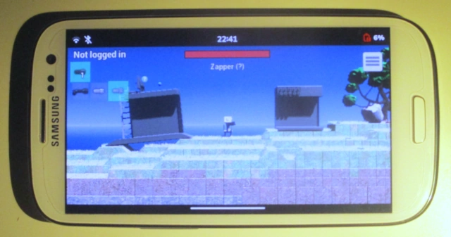

Hello, Principia 2024.07.12 has been released. It fixes some bugs and regressions found in the previous version.

As usual, you can find downloads on the **[Download](/download)** page. F-Droid and various Linux distribution packages should receive the update within due time.

This release is a relatively minor one for fixing issues that were uncovered in the previous release. Most notably it fixes VSync being accidentally disabled on Android in the last release as a result of the SDL2 upgrade, which likely caused significant battery drain if you push enough frames.

<figure>
	
	<figcaption>That's a lot of frames!</figcaption>
</figure>

The Android build available for download on the download page was hotfixed a couple hours later when this was discovered, but the unfixed version of 2024.06.28 had already made its way to F-Droid and was already in their build pipeline. So for people using the F-Droid version, this issue should finally be fixed once this version is live on F-Droid.

In addition to that there are other fixes for different platforms, such as Principia now working with SDL2's Wayland video driver on Linux (try passing `SDL_VIDEODRIVER=wayland` when running the AppImage!) and fixing an issue for compiling the full game on Alpine Linux. Latter was discovered by kittynunu when trying to compile the game on the Alpine-based postmarketOS distribution mainly targetting mobile devices.

With the fix applied and when building the game with OpenGL ES enabled  (`USE_GLES=1`) Principia now runs on postmarketOS! The full story about getting Principia to run on kittynunu's postmarketOS phone can be read on [Mastodon](https://fosstodon.org/@principia/112740806183744360) but here is an image showing Principia running on it:

<figure>
	
	<figcaption>Principia on a Samsung Galaxy S3 running postmarketOS (kittynunu)</figcaption>
</figure>

For a full list of changes in this release see [the Changelog](/wiki/Changelog).

---

Cover image: [Bee Smasher Mini Game](https://archive.principia-web.se/level/6389) by rom1k
