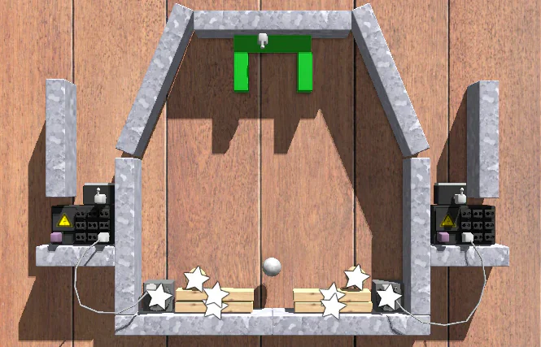
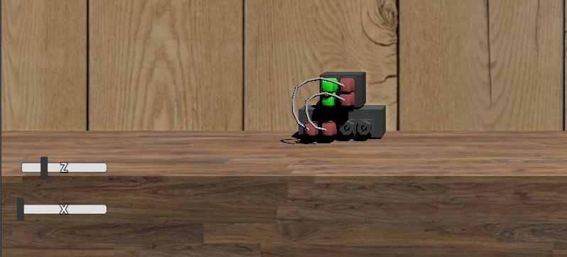

Hello, Principia 2025.04.05 has been released. In the months since the last release, things have been slow but there has been a lot of changes accumulated since then to warrant a new release.

As usual, you can find downloads on the **[Download](/download)** page, and the full list of changes in [the Changelog](/wiki/Changelog). F-Droid and various Linux distribution packages should receive the update within due time.

## Puzzles!
Puzzles are a level type in Principia that may be commonly overlooked nowadays. They were deprecated in Principia 1.5 along with the new focus on the adventure mode of the game, removing the ability to create puzzles in the sandbox, and the only playable puzzles remaining were the ones that come with the game.

This has generally been considered to be a mistake.

It has long been my hope that puzzles could come back as a fully functional level type alongside the current custom and adventure level types, and when the game was released as open source one of my personal goals was to make puzzles functional again. It has taken some time, but it is finally here.

<figure>
	
	<figcaption><a href="https://principia-web.se/level/1181">"Apparatus level 34 in Principia"</a></figcaption>
</figure>

Opening the create menu will now show a new "Puzzle" button to create a puzzle level. There is now also [a category for puzzle levels](/latest/puzzle) created by other players on the community site. I am sure there will appear more puzzle levels there within due time.

## Reworked play menu
The previous state of the play menu has been unfortunate, acting as a drawer of junk that has accumulated during the game's development. If you've discovered the game after the open source release and your first impression was of the play menu, the contents of it might have caused some confusion about what the game is about.

Now the play menu has been reworked, with the topmost button taking you to a new [browse](/browse) page on the community site that takes you directly into the . The ability to open save states of previously played levels is also still present.

<figure>
	
	<figcaption></figcaption>
</figure>

The exploration mode as available through the play menu has been removed. [Adventure levels](/latest/adventure) themselves and the associated game objects are not going anywhere, and the procedurally generated terrain is still available as an option in the sandbox. The exploration mode in the play menu was a remnant of the ill-fated attempt to pivot Principia into a story-based adventure game, and removing it has been long overdue.

The classic puzzle package has not been removed, and are still [available to play here](/classic-puzzles), linked from the browse page. It will appear in the play menu after you have opened it once.

## Window resizing
Principia has never supported resizing the window, but early on in the open source development the window was made resizable. This has likely been a mistake as while the game did handle resize events, it has never been fully supported. As such there would be countless issues where parts of the GUI will not adjust to the new window size, making the game gradually break down until you restarted.

Some of the most glaring issues related to resizing the window have been fixed in this version, but it is still far from perfect. Since most people have probably been resizing the game without knowing that it breaks stuff, the window is no longer resizable. You can still make the window resizable by enabling the "Resizable window" setting, at your own risk.

## Plenty of bugfixes
This release contains a lot of bugfixes, some of which were in the game as far back as before the 1.5 release.

One major fix I am happy to announce is that the [Level Manager](/wiki/Level_Manager) now works again. The purpose of the object is to adjust the ambient and diffuse light of the world, and was originally introduced in 1.5. It was later broken in 1.5.1 following changes to the game's shader code, but is now functional again.

<figure>
	
	<figcaption>The light curves look a bit strange, but that's for another day.</figcaption>
</figure>

In addition to that there have been countless other bugfixes, fixing everything from crashes to graphical glitches and unintended behaviour.

For a full list of changes in this release see [the Changelog](/wiki/Changelog).

---

Cover image: "[THE IMPOSSIBLE STORY OF A STUPID DUMMY](https://principia-web.se/archive/level/1188)" by TechZ
