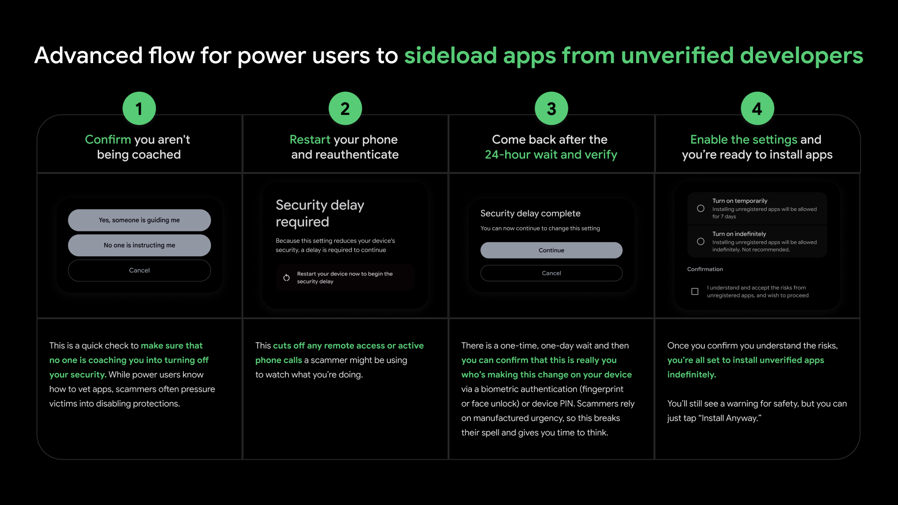

When Principia was originally made open source in 2022, the plan was for Bithack to republish the Android version of Principia onto Google Play as a free app after we had gotten the game's codebase into a functional state. This plan eventually fell through, and for the years that Principia has been open source we have had no presence on Google Play whatsoever, instead opting to distribute Principia as an APK file you manually install onto your device.

Right now, in order to install an APK file on your Android device, you need to go through some steps to allow installing apps from unknown sources. This may be a minor inconvenience but has worked well enough for Principia, and without anyone else willing to deal with the burden of publishing Principia onto Google Play this has been the situation up to this point.

## "Elevating Android Security"
Unfortunately, in August of 2025 [Google announced on their developer blog](https://android-developers.googleblog.com/2025/08/elevating-android-security.html) that they will be changing the terms for how we are able to install apps onto the devices that we own. Every app you install must be from a *verified developer*.

But how do you become a verified developer? Give Google some money, some personal information, and what exactly of that information Google will publish is unclear. But I have already been personally burnt once with [Google's recent developer verification policies on Google Play](https://voxelmanip.se/2025/02/01/goodbye-google-play/), and I'm not terribly optimistic about what personal information Google will want to publish about me if I follow this new developer verification process.

Personally I also consider this gross overreach from Google's part as a third-party, restricting what you can do with a device that you have bought from the manufacturer. But I'll focus on how this will affect Principia if I cannot comply with the new developer verification process.

With the current timeline laid out by Google, the new app verification process will roll out in Brazil, Singapore, Indonesia and Thailand in September of 2026. It will then roll out to the rest of the world in 2027. Past this point, Principia will become significantly harder to install on Android.

While Principia has since become available on the alternative Android app store F-Droid, it too is affected by these changes and [has gone on record to refuse complying with these new policies too](https://f-droid.org/en/2026/02/24/open-letter-opposing-developer-verification.html). Regardless of where you obtain Principia, you will be affected.

## The new advanced app installation flow
Thankfully, [Google announced an advanced app installation flow](https://android-developers.googleblog.com/2026/03/android-developer-verification.html) with which you can still install Principia in the future. It will just be a bit more involved. This is an infographic from Google that shows the new flow for installing apps not from a verified developer:

<figure>
	
	<figcaption>Thanks Google! <a href="images/25/advanced_app_installation_flow.txt" target="_blank">(Text version)</a></figcaption>
</figure>

In addition to this, you can still install apps from a computer using ADB and USB debugging, but this requires a computer and some command-line knowledge.

## Read more...
If you would like to read more about the ongoing situation, [keepandroidopen.org](https://keepandroidopen.org/) is the canonical resource for resistance against the upcoming changes. You can contact relevant national or international regulators and make your voice heard, if you would like to push back against these changes from Google.

An ongoing discussion has also been taking place [here on the Principia forums](/forum/thread?id=67), ever since the original announcement was made by Google.
